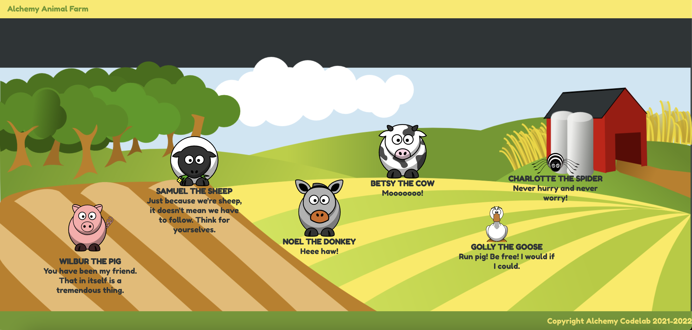

# React Animal Farm

**Use [this app](https://github.com/alchemycodelab/react-animal-farm) as a template for your deliverable!**

### Learning Objectives

- Use `className` attribute to set styles versus `style = {{ background: 'magenta' }}`
- Display images in a React app
- Use attributes in parent components to pass data down to child components as props
- Use `{}` as "portals" in the render method to do JavaScript inside our HTML
- Use .map to iterate over an array and render new elements for each item in an array
- Use jsx to produce & render a React component
- Use Netlify to deploy a React app

### Description

Welcome to the Alchemy Farm! For this deliverable, you will practice creating functional components, mapping through lists and rendering a component for each item.

There is a list of animals provided for you in `data.js`, as well as an empty `<Main />` component and an empty `<Animal />` component. You need to add the code to display the animals by mapping through the list provided and rendering an `<Animal />` component for each animal. The final product should look like this:

### Acceptance Criteria

- `<Main />` should import `background.png` and set it as a background image on the `<main>` element
- `<Main />` component should use a `.map` to loop through and render an `<Animal />` component for each animal listed in `data.js`
- Animals should be positioned dynamically using the `style` attribute in JSX and props
- <Animal /> should utlize the existing classes in `Animal.css`
- App should be deployed on Netlify

### Rubric

| Task                                                                        | Points |
| --------------------------------------------------------------------------- | ------ |
| Main branch deployed to Netlify                                             | 0.5    |
| Open PR from `dev` branch with Netlify deploy preview                       | 0.5    |
| Uses a `.map` to render `<Animal />` component for each animal in `data.js` | 3      |
| Properly passes props to `<Animal />`                                       | 3      |
| Dynamically sets the `style` attribute in JSX to position the animals       | 2      |
| Utilizes existing classes to properly display animals                       | 1      |

### Stretch Idea

- Find some audio sounds of farm animals and research how to add click handlers to elements in React - play the sound on click

### Image Attribution

Background Image by <a href="https://pixabay.com/users/openclipart-vectors-30363/?utm_source=link-attribution&amp;utm_medium=referral&amp;utm_campaign=image&amp;utm_content=147828">OpenClipart-Vectors</a> from <a href="https://pixabay.com/?utm_source=link-attribution&amp;utm_medium=referral&amp;utm_campaign=image&amp;utm_content=147828">Pixabay</a>
